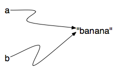
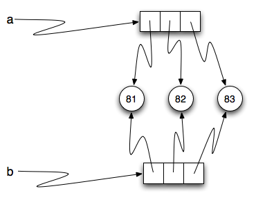
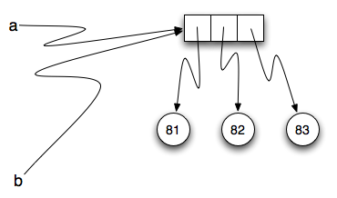

## Memory reference and Mutability 

**Strings** are immutable so Python saves memory and points to the same memory location:



**Lists** are mutable so they refer to different location, but the immutable elements inside list will indeed point to the same locations.



### Aliasing

Since variables refer to objects, if we assign one variable to another, both variables refer to the same object:

```python
a = [81, 82, 83]
b = a
print(a is b)

>>> True
```



Because the same list has two different names, `a` and `b`, we say that it is **aliased**. Changes made with one alias affect the other.

Although this behavior can be useful, it is sometimes unexpected or undesirable. In general, it is safer to avoid aliasing when you are working with mutable objects. Of course, for immutable objects, there’s no problem. That’s why Python is free to alias strings and integers when it sees an opportunity to economize.

### Cloning

```python
a = [1,2,3]
b = a 
a is b
>>> True

b = a[:]
a == b
>>> False
```

### Repeating

```python
origlist = [45, 76, 34, 55]
newlist = [origlist] * 3		# keep reference as the original list
anotherlist = origlist * 3		# creates new list based on the original list

print(newlist)
print(anotherlist)

origlist[1] = 99

print(newlist) 				# Note the change
print(anotherlist) 			# Note the lack of change

>>> [[45, 76, 34, 55], [45, 76, 34, 55], [45, 76, 34, 55]]
>>> [45, 76, 34, 55, 45, 76, 34, 55, 45, 76, 34, 55]
>>> [[45, 99, 34, 55], [45, 99, 34, 55], [45, 99, 34, 55]]
>>> [45, 76, 34, 55, 45, 76, 34, 55, 45, 76, 34, 55]
```

### Append versus Concatenate

With append, the original list is simply **modified**. On the other hand, with concatenation, an entirely new list is created, which makes sense considering its behavior if assigned to a different variable. **Append** mutates and does not return anything. Cannot be used for reassignment.  

```python
origlist = [1,2,3,4]
origlist = origlist + ["cat"]

origlist.append(3)
```
