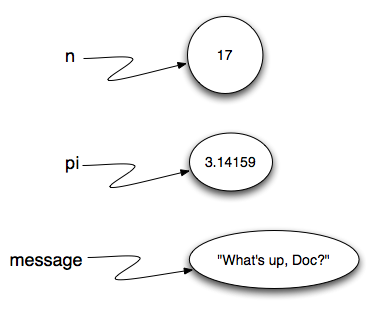
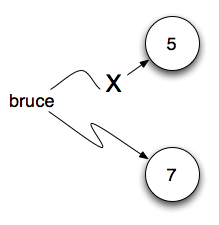

## Simple Python Data
### Values and Data Types

**value** - is one of the fundamental things — like a word or a number — that a program manipulates. We often refer to these values as **objects** and we will use the words value and object interchangeably.

**objects** are classified into different **classes** or **data types**:

* integers (4,5,6,7, natural numbers)
* floats (4.3, floating-point numbers)
* strings (text, any text, even number in text) - single or double quote => absolutely no diff in Python

### Type conversion functions

**int** - converting to integer, either float, or string that contains number, always cuts down

**float** - converts to float, int or string, containing number. Adding `.0`  to into and conversing str as needed

**str** - turns integers and floats into strings

```python
print("2345", int("2345"))
> 2345 2345
print(17, int(17))
> 17 17
print(int("23bottles")
> ValueError: invalid literal for int() with base 10: '23bottles' on line 5

print(float("123.45"))
> 123.45
print(type(float("123.45")))
> <class 'float'>

print(str(17))
> 17
print(str(123.45))
> 123.45
print(type(str(123.45)))
> <class 'str'>
```

### Variables

**Assignment statements** create new variables and also give them values to refer to.

```
message = "What's up, Doc?"
n = 17
pi = 3.14159
```

> **assignment token**`=`  should not be confused with **equality** 

#### state snapshot

This kind of figure, known as a **reference diagram**, is often called a **state snapshot** because it shows what state each of the variables is in at a particular instant in time. 



### Variable names and keywords

* can be arbitrarily long

* contain both letters and digits

* HAVE TO BEGIN with a letter or _underscore

* legal to use uppercase letters, by convention we don’t

* it is common to split words with an underscore `just_like_that`

* no $peci@l characters

* no **keywords** - keywords are Python syntax words. Sometimes modules have them too:

```python
and	as	assert	break	class	continue
def	del	elif	else	except	exec
finally	for	from	global	if	import
in	is	lambda	nonlocal	not	or
pass	raise	return	try	while	with
yield	True	False	None	 	 
```

### Statements and Expressions

A **statement** is an instruction that the Python interpreter can execute. 

* assignment statement
* `while`statements
* `for` statements
* `if` statements
* `import` statements
* (There are other kinds too!)

An **expression** is a combination of:
* values

* variables

* operators

* and calls to functions

Expressions need to be evaluated. If you ask Python to `print` an expression, the interpreter **evaluates** the expression and displays the result.

**Evaluation of an expression** produces a value. A value all by itself is a simple expression, and so is a variable. Evaluating a variable gives the value that the variable refers to.

**Statements**, such as the assignment statement, do not return a value.

>  **evaluation of an expression** produces a value

**UNDERPANTS** - statement just states something and Python is like "whatever, fine, i keep it". Expression is a statement + function to do sth with all that crap. So it grabs the statement and says, "oh, this is what you want me to do with it, OK, whatever"

### Operators and Operands

> operand operator operand
>
> 3                   +              4     

#### List of arithmetic operators:
* `+` addition
* `-` subtraction
* `*` multiplication
* `/` division
* `%` modulus
* `**` exponent
* `//` floor division, integer division


### Order of operations

1. Parentheses `()`
2. Exponentiation `**`
3. Multiplication/Division `*` `/` `//`
4. Addition/Subtraction `+` `-`

**!!! Operators with the *same* precedence are evaluated from left-to-right (except exponent)**

### Input

```python
name = input("What is your name?")
print("Hello", name)
```

> It is very important to note that the `input` function returns a string value. 

### Reassignment

```python
bruce = 5
bruce = 7
```



>  In some programming languages, a different symbol is used for assignment, such as `<-` or `:=`. The intent is that this will help to avoid confusion. Python chose to use the tokens `=`for assignment, and `==` for equality. This is a popular choice also found in languages like C, C++, Java, and C#.

### Updating Variables

```python
age = 23 
age = age + 1
age += 1 # 25
age *= 2 # 50
age -= 1 # 49
age /= 2 # 24.5
```

**increment** - adding 1

**decrement** - subtracting 1

**bumping** a variable  i.e. incrementing by 1

