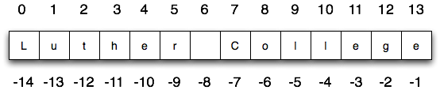

## 8. Strings (immutable)

Types that are comprised of smaller pieces are called **collection data types**. 

Depending on what we are doing, we may want to treat a collection data type as a single entity (the whole), or we may want to access its parts. This ambiguity is useful.

Strings can be defined as sequential collections of characters. This means that the individual characters that make up the string are assumed to be in a particular order from left to right.

A string that contains no characters, often referred to as the **empty string**, is still considered to be a string.

You can use **plus** for strings to **concatenate** two strings. And **multiply** by a number to add it that many times to itself:

```python
"hello" + " world"
>>> hello world
"hi" * 5
>>> hihihihihi
```

### Indexing



A substring of a string is called a **slice**. Selecting a slice is similar to selecting a character:

```python
str = "Hello you"
str[0]
str[0:3]
str[-1]
str[0:]
str[:4]
str[:]
```

### Methods

```python
str = "Hello, world"
str.upper()	# HELLO, WORLD
str.lower() # hello, world
```

| Method     | Parameters | Description                              |
| ---------- | ---------- | ---------------------------------------- |
| upper      | none       | Returns a string in all uppercase        |
| lower      | none       | Returns a string in all lowercase        |
| capitalize | none       | Returns a string with first character capitalized, the rest lower |
| strip      | none       | Returns a string with the leading and trailing whitespace removed |
| lstrip     | none       | Returns a string with the leading whitespace removed |
| rstrip     | none       | Returns a string with the trailing whitespace removed |
| count      | item       | Returns the number of occurrences of item |
| replace    | old, new   | Replaces all occurrences of old substring with new |
| center     | width      | Returns a string centered in a field of width spaces |
| ljust      | width      | Returns a string left justified in a field of width spaces |
| rjust      | width      | Returns a string right justified in a field of width spaces |
| find       | item       | Returns the leftmost index where the substring item is found |
| rfind      | item       | Returns the rightmost index where the substring item is found |
| index      | item       | Like `find` except causes a runtime error if item is not found |
| rindex     | item       | Like `rfind` except causes a runtime error if item is not found |

**Methods do not change the original string**. STRINGS ARE IMMUTABLE. [More methods](http://docs.python.org/py3k/library/stdtypes.html#index-21)

```python
fruit = "bnana"
lastch = fruit[len(fruit)-1]
```

### String comparison

**equality** `==` 

```python
"banan" == "banana"		# True
"apple" < "banana"		# True
"apple" == "Apple"		# False
"apple" < "Apple"		# False
```

Other comparison operations are useful for putting words in [lexicographical order](http://en.wikipedia.org/wiki/Lexicographic_order). This is similar to the alphabetical order you would use with a dictionary, except that all the uppercase letters come before all the lowercase letters.

It turns out, as you recall from our discussion of variable names, that uppercase and lowercase letters are considered to be different from one another. The way the computer knows they are different is that each character is assigned a unique integer value. “A” is 65, “B” is 66, and “5” is 53. The way you can find out the so-called **ordinal value** for a given character is to use a character function called `ord`.

There is also a similar function called `chr` that converts integers into their character equivalent.

```python
print(chr(65))
print(chr(66))
print(chr(49))
print(chr(53))
>>>
A
B
1
5
```

### Traversal

Often we start at the beginning, select each character in turn, do something to it, and continue until the end. This pattern of processing is called a **traversal**.

```python
for achar in "Go Spot Go":
    print(achar)
```

```python
fruit = "apple"
for idx in range(len(fruit)):
    print(fruit[idx])
```

```python
fruit = "apple"

position = 0
while position < len(fruit):
    print(fruit[position])
    position = position + 1
```

```python
print('x' not in 'apple')
```

```python
def find(string, char):
    idx = 0
    location = -1
    found = False
    while idx < len(string) and not found:
        if char == string[idx]:
            found = True
            location = idx
        else:
            idx += 1
    return location
```

#### optional parameter

```python
def find(string, char, start=0):              # start will be =0 if not given
    """
    Find and return the index of achar in astring.
    Return -1 if achar does not occur in astring.
    """
    idx = start
    found = False
    location = -1
    while idx < len(string) and not found:
        if string[idx] == char:
            found = True
            location = idx
        else:
            idx += 1
    return location

print(find('banana', 'a', 3))
>>> 3
```

```python
def find(astring, achar, start=0, end=None):
    """
    Find and return the index of achar in astring.
    Return -1 if achar does not occur in astring.
    """
    ix = start
    if end == None:
        end = len(astring)

    found = False
    while ix < end and not found:
        if astring[ix] == achar:
            found = True
        else:
            ix = ix + 1
    if found:
        return ix
    else:
        return -1

ss = "Python strings have some interesting methods."

print(find(ss, 's'))
print(find(ss, 's', 7))
print(find(ss, 's', 8))
print(find(ss, 's', 8, 13))
print(find(ss, '.'))
```

### String characters

It is often helpful to examine a character and test whether it is upper- or lowercase, or whether it is a character or a digit. The `string` module provides several constants that are useful for these purposes. One of these, `string.digits` is equivalent to “0123456789”. It can be used to check if a character is a digit using the `in` operator.

The string `string.ascii_lowercase` contains all of the ascii letters that the system considers to be lowercase. Similarly, `string.ascii_uppercase` contains all of the uppercase letters. `string.punctuation` comprises all the characters considered to be punctuation. Try the following and see what you get.

```python
import string

print(string.ascii_lowercase)
print(string.ascii_uppercase)
print(string.digits)
print(string.punctuation)

>>> abcdefghijklmnopqrstuvwxyz
>>> ABCDEFGHIJKLMNOPQRSTUVWXYZ
>>> 0123456789
>>> !"#$%&'()*+,-./:;<=>?@[\]^_`{|}~
```

```python
def count(text, aChar):
    lettercount = 0
    for c in text:
        if c == aChar:
            lettercount = lettercount + 1
    return lettercount

print(count("banana","a"))
```